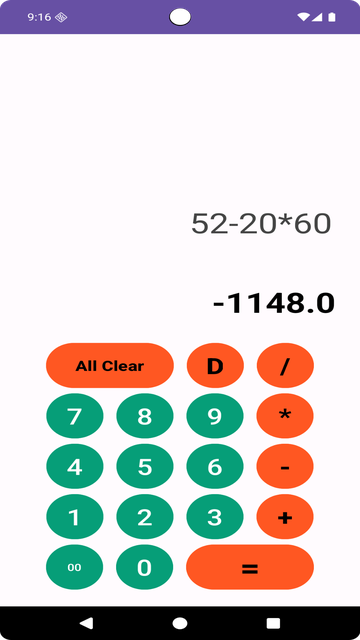

### 🧮 Modern Calculator App
A stylish and functional modern calculator built using Java and Android SDK, designed with simplicity and usability in mind.
Supports basic arithmetic operations with proper input validation and smooth UI interaction.

### 📸 Demo
Screenshot:

Demo GIF:

### 🚀 Features
🧠 Smart Input Validation
  - Prevents invalid expressions (like ending with +, /, etc.)
✍️ Expression Parsing & Evaluation
  - Only evaluates if expression contains a valid operator
🎨 Modern UI
  - Neat design with responsive button clicks
📱 Mobile-friendly & Lightweight.

### 🔧 How to Run
1. Clone the repository:
git clone https://github.com/yourusername/ModernCalculator.git
2. Open it in Android Studio.
3. Click Run ▶️ to build and launch the app on an emulator or device.

### 🛠️ Tech Stack
- Java
- Android SDK
- XML Layouts
